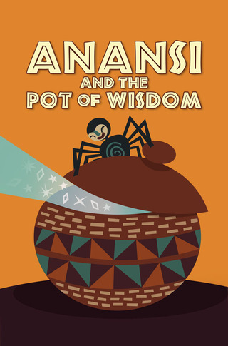

# AnansiPot  

In absence of searchable transcripts, many interesting YouTube videos, podcasts, lectures and talks are hard to explore, quote and summarize. **AnansiPot** is an open data project regrouping over 800 YouTube video transcripts discussing social and political issues, psychology, history and scientific topics ranging from biology, mathematics to artificial intelligence : The Joe Rogan Experience, The Rubin Report, Jordan B. Peterson talks, Lex Fridman lectures and more. This project is a first step towards making great content more available and inspiring speakers, storytellers, interviewers and scientists better heard. 

## [ :mag: &nbsp; Explore transcripts ](transcripts/en/#original-transcripts)

## Why this name, AnansiPot ? 
  Anansi is a West African folktale character. He often takes the shape of a spider and is considered to be the spirit of all knowledge of stories.

From https://mythology.net : 
> "Anansi is the King of Stories, the trickster, the joke maker, and the teacher of those who would follow these traditions. Anansi can be summoned by those with a gift for stories, either to listen to a well-told tale or to help someone who is talented but just beginning to become a master storyteller. [..] He had a pot containing all the wisdom of the world, and every day Anansi would look in the pot and learn some new and wondrous thing."

## Transcription quality 
These transcriptions are generated automatically using a high-accuracy large-vocabulary continuous speech recognition system (~90% of accuracy in clean conditions : no background noise, no heavy accents and good quality audio). 

## Filenames and formats 
The transcripts identified using the corresponding YouTube videos IDs and each one is available in three formats : text, vtt (Text Tracks Format) and srt (SubRip Subtitle Format).

## Terms of use 
This is an open data project, feel free to fork this repository, download, share and use any of the transcripts. 

## TODO 
- **Cleaning-up transcripts :** removing fillers (hum, ah, etc) and repetitions.
- **Topic modeling :** automatically discovering the abstract "topics" that occur in a each transcript.
- **Speaker identification :** who spoken when ? and for how long ?
- **Creating a search engine :** exploring subjects by speaker, topic, channel, etc.
- **Multiligual transcripts :** Translating all transcripts to other languages.
- More channels & more videos.
